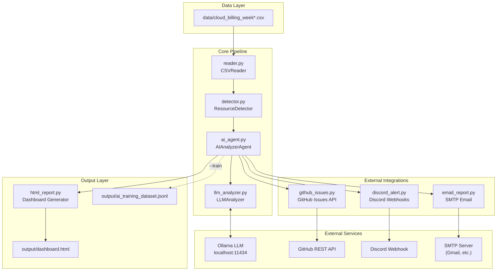

# Cloud Cost Optimizer

An autonomous Python AI agent that scans cloud billing data, detects idle and oversized resources, reasons about each finding with a local LLM (Ollama), files prioritized GitHub issues, sends Discord alerts, emails a formatted report, and generates a rich offline HTML dashboard with an embedded AI chatbot.

---

## Table of Contents

- [Business Problem](#business-problem)
- [Key Features](#key-features)
- [How It Works (Workflow)](#how-it-works-workflow)
- [Architecture](#architecture)
- [Tech Stack](#tech-stack)
- [Project Structure](#project-structure)
- [Sample Data & Test Cases](#sample-data--test-cases)
- [Detection Rules](#detection-rules)
- [Setup Instructions](#setup-instructions)
- [How To Run](#how-to-run)
- [Integrations](#integrations)
- [Dashboard & Website](#dashboard--website)
- [Sample Output](#sample-output)
- [Configuration Reference](#configuration-reference)
- [Extending to Real Cloud Data](#extending-to-real-cloud-data)
- [Requirements Checklist](#requirements-checklist)

---

## Business Problem

Cloud teams routinely waste budget on:

- **Idle compute** — EC2 instances running at single-digit CPU for weeks
- **Oversized databases** — RDS instances provisioned for peak load but averaging low utilization
- **Stale resources** — Resources with no meaningful activity for 30+ days still incurring monthly charges

Manual cost reviews are slow, inconsistent, and easy to deprioritize. **Cloud Cost Optimizer** automates discovery, prioritizes findings by severity and savings, routes actionable alerts to the tools teams already use (GitHub, Discord, email), and produces a visual dashboard for stakeholders.

---

## Key Features

| Feature | Description |
|---------|-------------|
| **CSV Billing Ingestion** | Loads and validates weekly billing snapshots from `data/` |
| **Heuristic Detection** | Flags idle and oversized EC2, RDS, and S3 resources using configurable thresholds |
| **AI Analysis (Ollama)** | Local LLM explains *why* each resource is wasteful and recommends a specific action |
| **Rule-Based Fallback** | Pipeline continues even when Ollama is offline — uses built-in heuristics |
| **GitHub Issue Filing** | Auto-creates labeled issues (`P0-critical`, `P1-warning`, `P2-low`) with duplicate detection |
| **Discord Alerts** | Sends rich embed alerts for P0 findings plus a scan summary to your channel |
| **Email Reports** | Delivers a styled HTML cost report via SMTP after every scan |
| **HTML Dashboard** | Dark-themed dashboard with SVG charts, severity breakdown, weekly trends, and AI chat |
| **Live Watch Mode** | Regenerates the dashboard automatically when the CSV file changes |
| **Interactive Q&A** | Ask cloud cost questions via CLI (`--ask`) or the dashboard chat (`--serve`) |
| **AI Training Export** | Generates `output/ai_training_dataset.jsonl` for fine-tuning from real findings |
| **Resilient Pipeline** | Each integration step is wrapped in safe error handling — one failure does not stop the run |

---

## How It Works (Workflow)

The agent runs as a **7-step pipeline** orchestrated by `main.py`:

```
┌─────────────────────────────────────────────────────────────────────────────┐
│                        CLOUD COST OPTIMIZER WORKFLOW                        │
└─────────────────────────────────────────────────────────────────────────────┘

  Step 1          Step 2           Step 3            Step 4
┌─────────┐    ┌──────────┐    ┌─────────────┐   ┌──────────────┐
│  Load   │───▶│  Detect  │───▶│  AI Analyze │──▶│ GitHub Issues│
│  CSV    │    │  Waste   │    │  (Ollama)   │   │  (optional)  │
└─────────┘    └──────────┘    └─────────────┘   └──────────────┘
     │               │                 │                  │
     │               │                 │                  ▼
     │               │                 │           Step 5: Discord
     │               │                 │           ┌──────────────┐
     │               │                 └──────────▶│ P0 alerts +  │
     │               │                             │ scan summary │
     │               │                             └──────────────┘
     │               │                                    │
     │               │                                    ▼
     │               │                             Step 6: Email
     │               │                             ┌──────────────┐
     │               │                             │ HTML report  │
     │               │                             │ via SMTP     │
     │               │                             └──────────────┘
     │               │                                    │
     │               └────────────────────────────────────┘
     │                                    │
     ▼                                    ▼
  Step 7: Generate Dashboard
┌──────────────────────────────────────────────────────────────┐
│  output/dashboard.html  — charts, findings, trends, chatbot  │
└──────────────────────────────────────────────────────────────┘
```

**Detailed flow:**

1. **Load** — `reader.py` reads `data/cloud_billing_week4.csv` (current week), validates columns, normalizes rows, and computes a waste score per resource.
2. **Detect** — `detector.py` applies idle/oversized heuristics, calculates potential savings, and assigns severity (P0 / P1 / P2).
3. **Analyze** — `ai_agent.py` + `llm_analyzer.py` send each finding to Ollama for structured JSON analysis (reason, recommendation, estimated saving).
4. **GitHub** — `github_issues.py` files prioritized issues with `cost-optimization` labels; skips duplicates already open.
5. **Discord** — `discord_alert.py` posts P0 critical embeds and a full scan summary to your webhook channel.
6. **Email** — `email_report.py` sends a formatted HTML report with all findings and GitHub issue links.
7. **Dashboard** — `html_report.py` writes `output/dashboard.html` with weekly trend charts and opens it in the browser.

---

## Architecture



**Design principles:**

- **Modular** — Each integration is a standalone module; enable or disable via flags or `.env`.
- **Decoupled reader** — Swap `CSVReader` for AWS Cost Explorer / boto3 without changing the rest of the pipeline.
- **Fail-safe** — `safe_action()` in `main.py` catches errors per step so Discord or email failures do not block dashboard generation.

---

## Tech Stack

| Layer | Technology |
|-------|------------|
| Language | Python 3.10+ |
| AI / LLM | Ollama (`llama3` default) via REST API |
| HTTP | `requests` |
| Config | `python-dotenv` (`.env`) |
| Issue Tracking | GitHub Issues REST API |
| Notifications | Discord Webhooks (rich embeds) |
| Email | SMTP + `smtplib` (HTML multipart) |
| Dashboard | Pure HTML/CSS/SVG — no frontend build step |
| Data Format | CSV billing snapshots |

---

## Project Structure

```
cloud_cost_optimizer/
├── data/                          # Weekly billing CSV snapshots
│   ├── cloud_billing_week1.csv
│   ├── cloud_billing_week2.csv
│   ├── cloud_billing_week3.csv
│   └── cloud_billing_week4.csv    # ← current week (default)
├── output/                        # Generated artifacts
│   ├── dashboard.html             # Interactive cost dashboard
│   └── ai_training_dataset.jsonl  # Fine-tuning export
├── src/
│   ├── reader.py                  # CSV ingestion & validation
│   ├── detector.py                # Idle/oversized detection heuristics
│   ├── llm_analyzer.py            # Ollama integration + fallback logic
│   ├── ai_agent.py                # Agent loop wrapper (enable/disable AI)
│   ├── github_issues.py           # GitHub issue creation & dedup
│   ├── discord_alert.py           # Discord webhook alerts
│   ├── email_report.py            # SMTP HTML email reports
│   └── html_report.py             # Dashboard generator + chat UI
├── website/
│   └── index.html                 # Project landing page
├── main.py                        # CLI entry point & pipeline orchestrator
├── config.py                      # Thresholds, paths, feature flags
├── requirements.txt
└── README.md
```

---

## Sample Data & Test Cases

The `data/` folder contains **four weeks** of mock AWS-style billing data. Each CSV has the same schema:

| Column | Type | Description |
|--------|------|-------------|
| `resource_id` | string | Unique identifier (e.g. `ec2-web-04`) |
| `type` | string | Resource type: `EC2`, `RDS`, `S3` |
| `region` | string | AWS region (e.g. `us-east-1`) |
| `cpu_avg_percent` | float | Average CPU utilization (%) |
| `memory_avg_percent` | float | Average memory utilization (%) |
| `cost_monthly_usd` | float | Monthly cost in USD |
| `last_active_days` | int | Days since last meaningful activity |

### Week 4 sample rows (current default)

```csv
resource_id,type,region,cpu_avg_percent,memory_avg_percent,cost_monthly_usd,last_active_days
ec2-web-04,EC2,us-east-1,3,49,200.00,40
rds-db-04,RDS,us-east-1,7,80,350.00,25
s3-archive-02,S3,us-east-1,0,0,100.00,0
ec2-api-04,EC2,us-east-1,61,38,205.00,3
rds-analytics-02,RDS,us-east-1,14,68,320.00,18
ec2-batch-04,EC2,us-east-1,73,34,215.00,2
rds-report-03,RDS,us-east-1,18,60,285.00,8
ec2-dev-02,EC2,us-east-1,9,22,180.00,12
```

### Expected findings (Week 4)

| Resource | Issue Type | Why Flagged | Est. Severity |
|----------|------------|-------------|---------------|
| `ec2-web-04` | Idle | 3% CPU, 40 days inactive, $200/mo | **P0** |
| `rds-db-04` | Idle | 7% CPU, 25 days inactive, $350/mo | **P0** |
| `s3-archive-02` | Idle | 0% CPU, $100/mo | **P0** |
| `rds-analytics-02` | Oversized | 14% CPU on $320 RDS | **P1** |
| `rds-report-03` | Oversized | 18% CPU on $285 RDS | **P1** |
| `ec2-dev-02` | Idle | 9% CPU, $180/mo | **P1** |
| `ec2-api-04` | — | Healthy utilization (61% CPU) | Not flagged |
| `ec2-batch-04` | — | Healthy utilization (73% CPU) | Not flagged |

### Weekly trend data

All four weeks are scanned during dashboard generation to plot waste trends:

| Week File | Notable Waste Pattern |
|-----------|----------------------|
| `week1` | `ec2-web-01` idle at 8% CPU, 32 days stale |
| `week2` | `rds-analytics-01` oversized at 9% CPU, $340/mo |
| `week3` | `ec2-web-03` idle at 4% CPU, 35 days stale |
| `week4` | Highest waste week — multiple P0 idle resources |

---

## Detection Rules

Configured in `config.py`:

| Threshold | Default | Purpose |
|-----------|---------|---------|
| `CPU_THRESHOLD` | 10% | Flag resources below this CPU as idle |
| `MEMORY_THRESHOLD` | 20% | Flag resources below this memory as idle |
| `STALE_DAYS_THRESHOLD` | 30 days | Flag resources inactive longer than this |
| `COST_THRESHOLD` | $50/mo | Minimum cost to consider for idle detection |

**Severity assignment:**

| Severity | Criteria |
|----------|----------|
| **P0** (Critical) | Savings > $250, or CPU < 3%, or inactive > 30 days |
| **P1** (Warning) | Savings ≥ $120, or CPU < 7% |
| **P2** (Low) | Everything else flagged |

**Savings estimation:**

- Stale resource (>30 days): up to **90%** of monthly cost
- Low CPU/memory: up to **75%** of monthly cost
- Oversized (CPU < 15%, cost > $150): up to **55%** of monthly cost
- Other flagged resources: up to **35%** of monthly cost

---

## Setup Instructions

### 1. Clone or open the project

```bash
cd cloud_cost_optimizer
```

### 2. Install dependencies

```bash
pip install -r requirements.txt
```

### 3. Install and start Ollama (for AI analysis)

```bash
# Install from https://ollama.ai, then pull the model:
ollama pull llama3
ollama serve
```

### 4. Create a `.env` file

Create `.env` in the project root with your integration credentials:

```env
# GitHub Issues
GITHUB_TOKEN=ghp_your_personal_access_token
GITHUB_REPO=your-username/cloud_cost_optimizer

# Discord Alerts
DISCORD_WEBHOOK_URL=https://discord.com/api/webhooks/your_webhook_id/your_token

# Email Reports (SMTP)
EMAIL_SENDER=your-email@gmail.com
EMAIL_PASSWORD=your_app_password
EMAIL_RECEIVER=team@company.com
SMTP_SERVER=smtp.gmail.com
SMTP_PORT=587

# Ollama
OLLAMA_MODEL=llama3
OLLAMA_URL=http://localhost:11434/api/generate

# Feature flags (all enabled by default)
ENABLE_AI_AGENT=true
ENABLE_GITHUB_ISSUES=true
ENABLE_DISCORD_ALERTS=true
ENABLE_EMAIL_REPORT=true
```

> **Note:** Discord and email integrations are **fully implemented and enabled by default**. Add your webhook URL and SMTP credentials to `.env` to activate them. The pipeline skips gracefully with a warning if credentials are missing.

---

## How To Run

### Standard scan (all integrations on by default)

```bash
python main.py
```

### Enable specific integrations via CLI flags

```bash
python main.py --github --discord --email --ai
```

### Ask a cloud cost question directly

```bash
python main.py --ask "How can I reduce RDS costs for underutilized databases?"
```

### Generate AI training data from latest findings

```bash
python main.py --train
```

### Live watch mode — auto-refresh when CSV changes

```bash
python main.py --watch 10
```

### Serve dashboard with built-in AI chat

```bash
python main.py --serve
```

### Full production run with all features

```bash
python main.py --watch 10 --github --discord --email --ai --serve
```

### CLI reference

| Flag | Description |
|------|-------------|
| `--ask "question"` | Ask the LLM a cloud cost question and exit |
| `--watch [seconds]` | Watch CSV for changes and regenerate (default: 10s) |
| `--train` | Export AI training dataset to `output/` |
| `--github` | Enable GitHub issue filing |
| `--discord` | Enable Discord alerts |
| `--email` | Enable email report delivery |
| `--ai` | Enable Ollama AI analysis |
| `--serve` | Start local HTTP server with dashboard chat at `http://127.0.0.1:8000` |
| `--no-browser` | Skip auto-opening the dashboard in the browser |

---

## Integrations

### GitHub Issues

- Creates issues with title format: `[P0] ec2-web-04 is underutilized — save $180/month`
- Applies labels: `cost-optimization`, `P0-critical` / `P1-warning` / `P2-low`
- Checks for duplicate open issues before filing
- Issue body includes full resource metrics and AI analysis

### Discord Alerts

- **P0 critical alerts** — Rich embed per critical finding with resource details, savings estimate, and recommended action
- **Scan summary** — Channel-wide summary with P0/P1/P2 breakdown and total monthly savings
- Color-coded embeds: red (P0), yellow (P1), green (P2)

### Email Reports

- HTML email with dark theme matching the dashboard
- Summary section: total issues, estimated savings, GitHub links
- Per-resource table: ID, type, severity, saving, recommendation
- Sent automatically after each scan when SMTP is configured

---

## Dashboard & Website

| Asset | Location | Description |
|-------|----------|-------------|
| **Landing page** | `website/index.html` | Static project overview — open directly in browser |
| **Live dashboard** | `output/dashboard.html` | Generated after each scan — charts, findings table, AI chat |
| **Served dashboard** | `http://127.0.0.1:8000/dashboard.html` | Available with `--serve` flag; chat POSTs to `/chat` |

**Dashboard includes:**

- Total monthly cost and waste summary cards
- Severity breakdown (P0 / P1 / P2) with SVG donut chart
- Weekly waste trend line chart (all 4 weeks)
- Per-resource findings table with AI recommendations
- Embedded AI chatbot (when served with `--serve`)
- GitHub issue links for filed findings

---

## Sample Output

### Terminal

```
╔═══════════════════════════════════════════╗
║     ☁️  CLOUD COST OPTIMIZER AGENT        ║
║     Powered by Ollama + GitHub API        ║
╚═══════════════════════════════════════════╝

⚙️  AI=on | GitHub=on | Discord=on | Email=on

📂 Step 1/7 - Loading billing CSV data
  • Resources loaded: 8
  • Total monthly cost: $1,855.00
  • Average cost per resource: $231.88

ℹ️ AI agent is enabled; analyzing findings with the LLM.
    • Discord alert for ec2-web-04: sent
    • Discord alert for rds-db-04: sent
  • Dashboard generated at: output/dashboard.html

╔═══════════════════════════════════════════╗
║ Resources scanned: 8                      ║
║ Issues found:      6                      ║
║ Total savings:     $892.50                ║
║ GitHub issues:     6                        ║
║ Time taken:        12.34s                  ║
╚═══════════════════════════════════════════╝
```

### Generated files

| File | Description |
|------|-------------|
| `output/dashboard.html` | Full interactive cost dashboard |
| `output/ai_training_dataset.jsonl` | Prompt/completion pairs for LLM fine-tuning |

### External notifications

- GitHub issues filed with `cost-optimization` label
- Discord P0 alerts + scan summary embed in your channel
- HTML email report delivered to `EMAIL_RECEIVER`

---

## Configuration Reference

All settings live in `config.py` and can be overridden via `.env`:

| Variable | Default | Description |
|----------|---------|-------------|
| `GITHUB_TOKEN` | — | GitHub personal access token |
| `GITHUB_REPO` | `owner/repo` | Target repository for issues |
| `DISCORD_WEBHOOK_URL` | — | Discord incoming webhook URL |
| `EMAIL_SENDER` | — | SMTP sender address |
| `EMAIL_PASSWORD` | — | SMTP password or app password |
| `EMAIL_RECEIVER` | — | Report recipient address |
| `SMTP_SERVER` | `smtp.gmail.com` | SMTP host |
| `SMTP_PORT` | `587` | SMTP port |
| `OLLAMA_MODEL` | `llama3` | Ollama model name |
| `OLLAMA_URL` | `http://localhost:11434/api/generate` | Ollama API endpoint |
| `ENABLE_AI_AGENT` | `true` | Toggle AI analysis |
| `ENABLE_GITHUB_ISSUES` | `true` | Toggle GitHub integration |
| `ENABLE_DISCORD_ALERTS` | `true` | Toggle Discord integration |
| `ENABLE_EMAIL_REPORT` | `true` | Toggle email integration |
| `CURRENT_WEEK_CSV` | `cloud_billing_week4.csv` | Active billing file |

---

## Extending to Real Cloud Data

The CSV reader is intentionally decoupled from cloud provider APIs. To connect to live AWS billing:

1. Replace `CSVReader.load_resources()` in `src/reader.py` with boto3 calls to **AWS Cost Explorer** and **CloudWatch**.
2. Return the same resource dictionary shape:

```python
{
    "resource_id": "i-0abc123",
    "type": "EC2",
    "region": "us-east-1",
    "cpu_avg_percent": 8.0,
    "memory_avg_percent": 42.0,
    "cost_monthly_usd": 160.00,
    "last_active_days": 32,
}
```

3. The rest of the pipeline — detection, AI analysis, GitHub, Discord, email, dashboard — stays **identical**.

---

## Requirements Checklist

- [x] **AI-Assisted Development** — Built with AI pair programming; modular agent architecture
- [x] **Agent Loop** — `AIAnalyzerAgent` orchestrates LLM analysis with retry and fallback
- [x] **External API Integration** — GitHub Issues API, Discord Webhooks, SMTP, Ollama REST API
- [x] **Notification Channels** — Discord alerts and email reports fully implemented
- [x] **Offline Dashboard** — Self-contained HTML dashboard with no external dependencies
- [x] **Watch Mode** — Live CSV monitoring with auto-regeneration
- [x] **Training Data Export** — JSONL dataset for model fine-tuning

---

## Team

Cloud Cost Optimizer was designed as a placement project with clean module separation, resilient error handling, and production-minded extensibility. Each integration module can be enabled, disabled, or swapped independently without affecting the core detection and reporting pipeline.